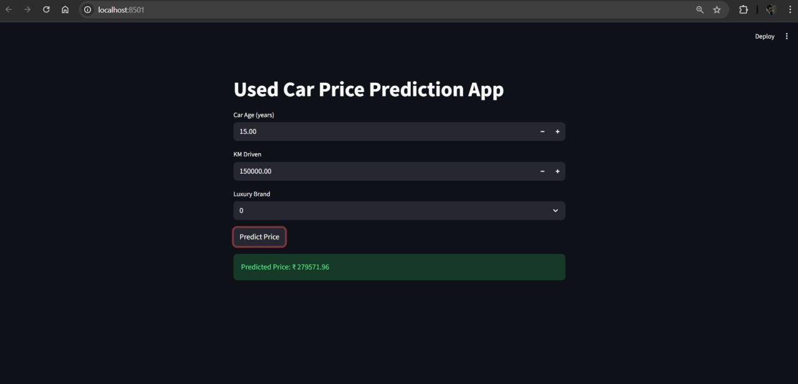
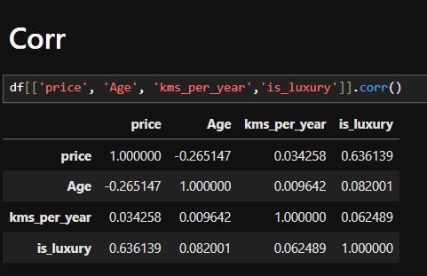
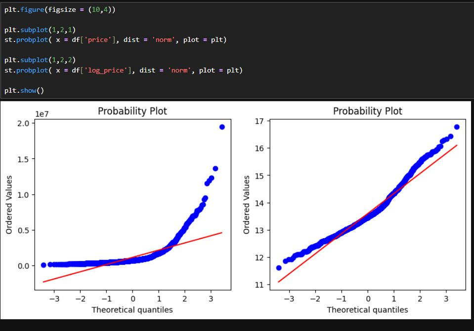

# Used Car Price Prediction ML System

An end-to-end machine learning application for predicting the price of used cars. The project covers the complete ML workflow — from data cleaning and exploratory data analysis to feature engineering, model comparison, hyperparameter tuning, and deployment through a FastAPI backend and Streamlit frontend.

## 🚗 Project Overview

Buying or selling a used car can be difficult because vehicle prices depend on many factors such as manufacturing year, mileage, fuel type, transmission, ownership history, and other vehicle characteristics.

This project uses machine learning to estimate a reasonable selling price for a used car based on its available features.

The final system provides:

* Data preprocessing and cleaning
* Exploratory Data Analysis (EDA)
* Feature engineering
* Multiple regression model experiments
* Hyperparameter tuning
* Ridge Regression as the final model
* REST API using FastAPI
* Interactive web interface using Streamlit

## 🧠 Machine Learning Workflow

```text
Raw Dataset
     │
     ▼
Data Cleaning
     │
     ▼
Exploratory Data Analysis
     │
     ▼
Feature Engineering
     │
     ▼
Train / Test Split
     │
     ▼
Model Training
     │
     ├── Multiple Regression Models
     │
     ▼
Hyperparameter Tuning
     │
     ▼
Ridge Regression
     │
     ▼
Saved Model
     │
     ├───────────────┐
     ▼               ▼
 FastAPI         Streamlit
   API              UI
     │               │
     └───────┬───────┘
             ▼
      Predicted Car Price
```

## ✨ Features

### Data Processing

* Cleaned raw vehicle data
* Handled missing and inconsistent values
* Prepared numerical and categorical features
* Removed or transformed unsuitable columns

### Exploratory Data Analysis

* Investigated relationships between vehicle attributes and price
* Examined distributions and potential outliers
* Identified important factors affecting used-car prices

### Feature Engineering

* Created useful model-ready features
* Transformed categorical variables
* Prepared numerical features for regression
* Built a consistent preprocessing pipeline

### Machine Learning

* Experimented with multiple regression algorithms
* Compared model performance
* Performed hyperparameter tuning
* Selected Ridge Regression as the final model

### Deployment

* **FastAPI** provides the prediction API
* **Streamlit** provides an interactive user interface
* The trained model can be used for real-time predictions






## 🛠️ Tech Stack

| Technology           | Purpose                            |
| -------------------- | ---------------------------------- |
| Python               | Core programming language          |
| Pandas               | Data manipulation                  |
| NumPy                | Numerical computing                |
| Scikit-learn         | Machine learning and preprocessing |
| Matplotlib / Seaborn | Data visualization                 |
| Jupyter Notebook     | Data analysis and experimentation  |
| FastAPI              | REST API                           |
| Uvicorn              | API server                         |
| Streamlit            | Interactive frontend               |

## 📁 Project Structure

```text
used-car-price-ml/
│
├── app/
│   ├── app.py
│   └── ...
│
├── data/
│   └── ...
│
├── notebooks/
│   └── ...
│
├── requirements.txt
├── README.md
└── .gitignore
```

## ⚙️ Installation

### 1. Clone the repository

```bash
git clone https://github.com/AION26/used-car-price-ml.git
cd used-car-price-ml
```

### 2. Create a virtual environment

```bash
python -m venv venv
```

Activate it:

**Windows**

```bash
venv\Scripts\activate
```

**macOS / Linux**

```bash
source venv/bin/activate
```

### 3. Install dependencies

```bash
pip install -r requirements.txt
```

## ▶️ Running the Application

The project contains both a FastAPI backend and a Streamlit frontend.

### Start the FastAPI backend

From the project root:

```bash
uvicorn api.main:app --reload
```

The API will start on the local development server.

You can also open the automatically generated API documentation at:

```text
/docs
```

### Start the Streamlit application

In a separate terminal:

```bash
streamlit run app/app.py
```

Streamlit will provide a local URL where you can interact with the prediction application.

## 🔌 API

The FastAPI backend exposes the machine-learning model through an HTTP API.

A typical prediction request contains the vehicle characteristics required by the trained model.

Example structure:

```json
{
  "year": 2018,
  "km_driven": 45000,
  "fuel": "Petrol",
  "seller_type": "Individual",
  "transmission": "Manual",
  "owner": "First Owner"
}
```

The API returns the model's predicted used-car price.

> The exact request fields should match the features expected by the trained model/API implementation.

## 📊 Model

The project evaluates multiple regression approaches before selecting the final model.

**Ridge Regression** is used as the final prediction model.

Ridge Regression is a regularized version of linear regression that adds an L2 penalty to the model's coefficients. This can help reduce overfitting, particularly when engineered features are correlated.

The general objective is:

```text
Minimize:

Σ(yᵢ - ŷᵢ)² + α Σβⱼ²
```

where:

* `yᵢ` = actual price
* `ŷᵢ` = predicted price
* `βⱼ` = model coefficients
* `α` = regularization strength

## 🔬 Machine Learning Pipeline

The project follows a standard supervised-learning workflow:

1. Load the dataset
2. Inspect the data
3. Clean invalid and missing values
4. Perform exploratory data analysis
5. Engineer relevant features
6. Encode categorical variables
7. Split data into training and testing sets
8. Train multiple regression models
9. Compare model performance
10. Tune hyperparameters
11. Select the best-performing model
12. Expose the model through an API
13. Build an interactive Streamlit interface

## 📈 Prediction

Once the application is running, users can provide vehicle information through the Streamlit interface and receive an estimated used-car price.

The prediction should be treated as an **estimate rather than a guaranteed market price**, since real-world vehicle prices can also depend on factors such as condition, location, demand, service history, modifications, and negotiation.

## 📚 Notebooks

The `notebooks/` directory contains the project's data analysis and machine-learning experimentation.

The notebooks cover areas such as:

* Data exploration
* Data cleaning
* Exploratory Data Analysis
* Feature engineering
* Model training
* Model comparison
* Hyperparameter tuning

## 🎯 Project Goals

The main goals of this project are to:

* Build a practical regression-based ML application
* Understand the factors influencing used-car prices
* Apply a complete ML preprocessing workflow
* Compare different regression algorithms
* Improve model performance through hyperparameter tuning
* Deploy the trained model through an API
* Provide an accessible interface for predictions

## 🚀 Future Improvements

Potential improvements include:

* Add more vehicle features to improve prediction accuracy
* Experiment with ensemble models such as Random Forest and Gradient Boosting
* Add cross-validation and more detailed model evaluation
* Track model metrics such as MAE, RMSE, and R²
* Add prediction confidence intervals
* Containerize the application with Docker
* Deploy the API and Streamlit application publicly
* Add automated model retraining
* Add model monitoring and data-drift detection
* Improve the UI with prediction history and visual analytics

## ⚠️ Disclaimer

This project is intended for educational and demonstration purposes.

Predicted prices are machine-learning estimates and should not be considered professional vehicle valuations or guaranteed market prices.

## 👤 Author

**AION26**

GitHub:
https://github.com/AION26

## ⭐ Contributing

Contributions, suggestions, and improvements are welcome.

If you find an issue or have an idea for improving the project:

1. Fork the repository
2. Create a new branch
3. Make your changes
4. Commit your changes
5. Open a pull request

## 📄 License

Add your preferred open-source license here, such as MIT, if you intend to distribute the project under that license.
